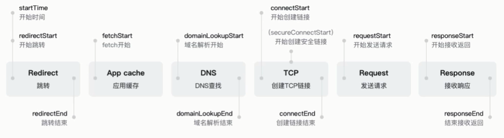
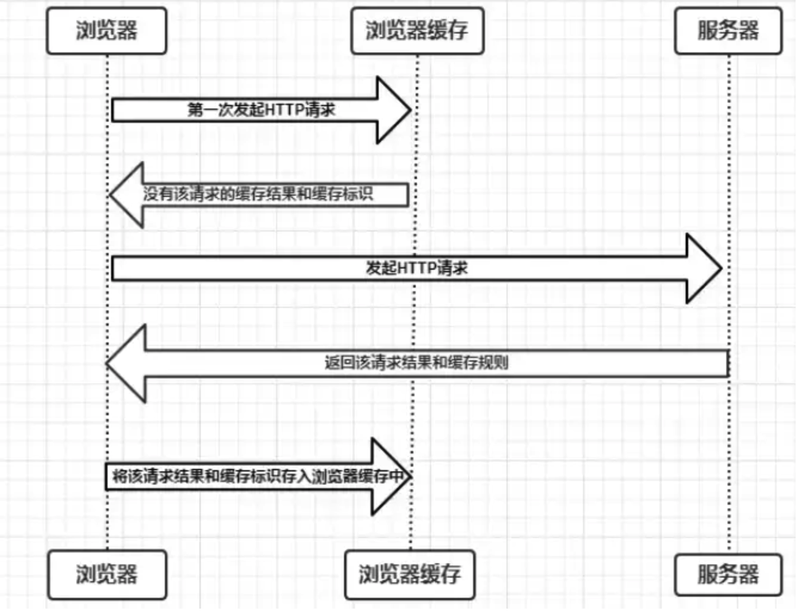
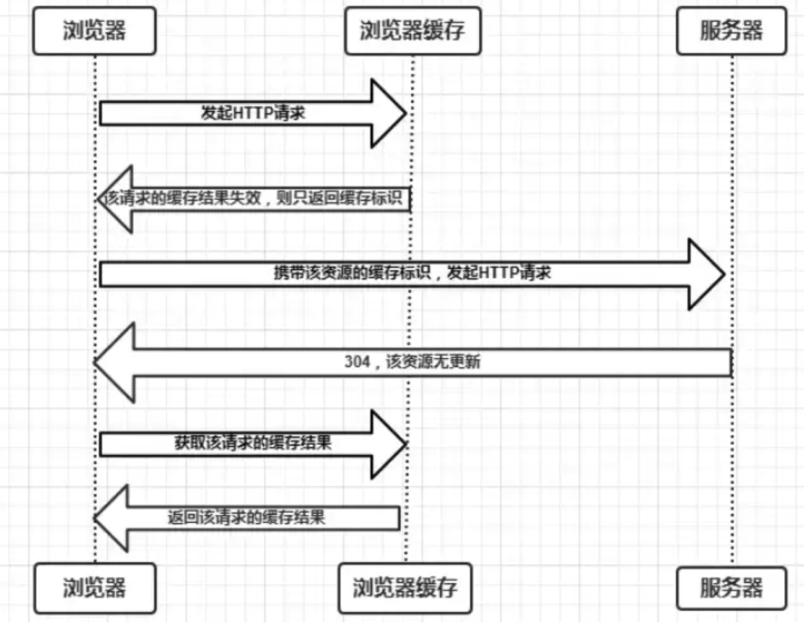
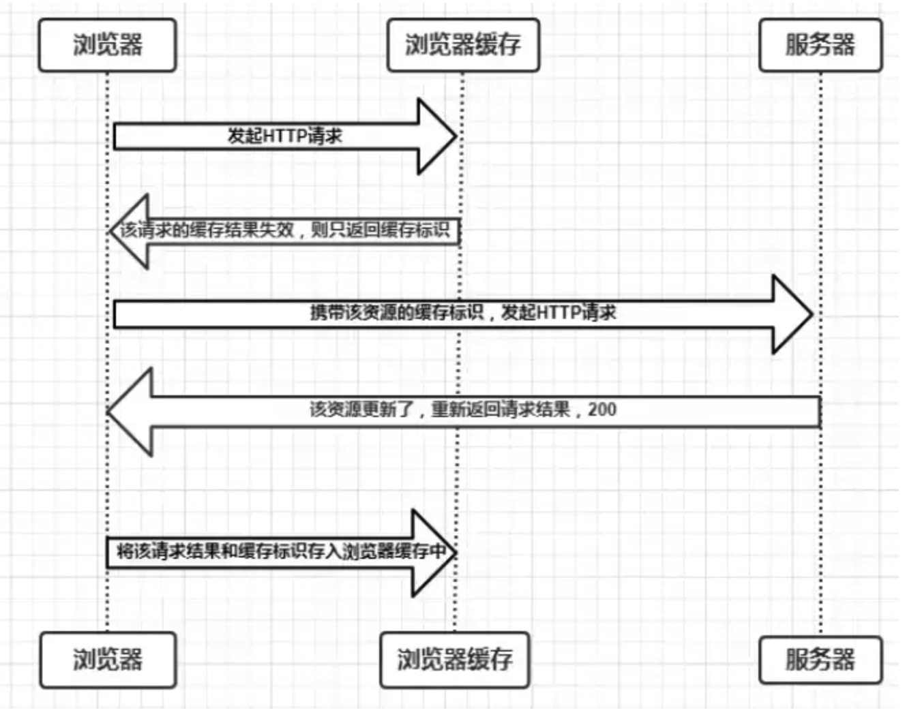
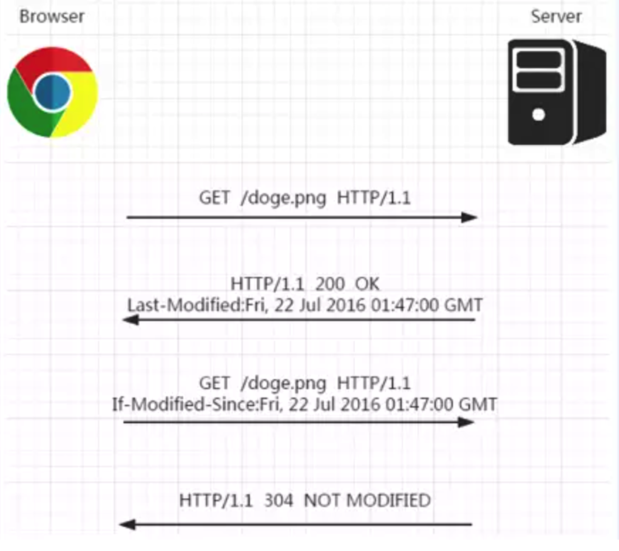
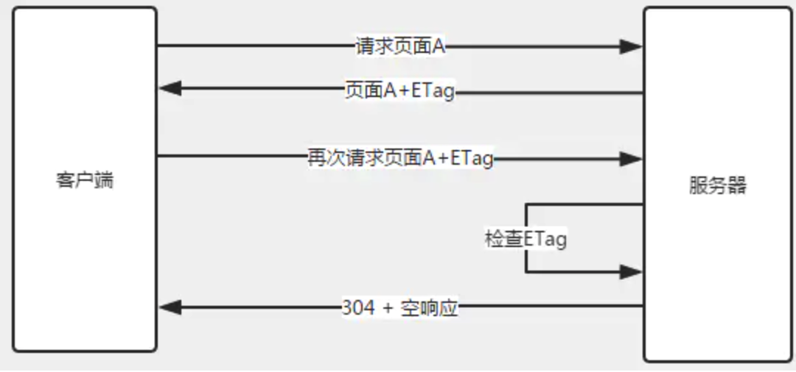

# 前端缓存机制

###一、浏览器输入URL后，HTTP请求返回的完整过程

###二、缓存位置

从缓存位置上来说分为四种，并且各自有优先级，当依次查找缓存且都没有命中的时候，才会去请求网络。

- Service Worker：运行在浏览器背后的独立线程，它的缓存与浏览器其他内建的缓存机制不同，它可以让我们自由控制缓存哪些文件、如何匹配缓存、如何读取缓存，并且缓存是持续性的。
- Memory Cache：内存中的缓存，主要包含的是当前中页面中已经抓取到的资源,例如页面上已经下载的样式、脚本、图片等。**一旦我们关闭 Tab 页面，内存中的缓存也就被释放了**。
- Disk Cache：存储在硬盘中的缓存，读取速度慢点，但是什么都能存储到磁盘中，**比之 Memory Cache 胜在容量和存储时效性上**。
- Push Cache：HTTP/2 中的内容，当以上三种缓存都没有命中时，它才会被使用。**它只在会话（Session）中存在，一旦会话结束就被释放，并且缓存时间也很短暂**

如果以上四种缓存都没有命中的话，那么只能发起请求来获取资源了。

###三、 缓存过程分析

浏览器第一次向服务器发起该请求后拿到请求结果后，将请求结果和缓存标识存入浏览器缓存，**浏览器对于缓存的处理是根据第一次请求资源时返回的响应头来确定的**。

+ 浏览器每次发起请求，都会先在浏览器缓存中查找该请求的结果以及缓存标识
+ 浏览器每次拿到返回的请求结果都会将该结果和缓存标识存入浏览器缓存中

###四、浏览器缓存策略

**常浏览器缓存策略分为两种：强缓存和协商缓存，并且缓存策略都是通过设置 HTTP Header 来实现的**。

> ####强缓存

不会向服务器发送请求，直接从缓存中读取资源，在chrome控制台的Network选项中可以看到该请求返回200的状态码，并且Size显示from disk cache或from memory cache。强缓存可以通过设置两种 HTTP Header 实现：Expires 和 Cache-Control。

### 1、Expires

缓存过期时间，用来指定资源到期的时间，是服务器端的具体的时间点。Expires 是 HTTP/1 的产物，受限于本地时间，如果修改了本地时间，可能会造成缓存失效。

`Expires: Fri, 05, Jul, 2020, 05:00:00 GMT`

### 2、Cache-Control

在HTTP/1.1中，Cache-Control是最重要的规则，主要用于控制网页缓存。比如当`Cache-Control:max-age=300`时，则代表在这个请求正确返回时间（浏览器也会记录下来）的5分钟内再次加载资源，就会命中强缓存。

`Cache-Control: max-age=300`

其他指令：

| 指令          | 作用                                                     |
| :------------ | :------------------------------------------------------- |
| public        | 所有内容都将被缓存（客户端和代理服务器都可缓存）         |
| private       | 所有内容只有客户端可以缓存，Cache-Control的默认取值      |
| max-age=xxx   | 缓存内容将在xxx秒后失效                                  |
| s-maxage=xxx  | 覆盖max-age，作用一样，只在代理服务器中生效              |
| no-store      | 所有内容都不会被缓存，即不使用强制缓存，也不使用协商缓存 |
| no-cache      | 客户端缓存内容，是否使用缓存则需要经过协商缓存来验证决定 |
| max-state=xxx | 能容忍的最大过期时间                                     |
| min-fresh=xxx | 能够容忍的最小新鲜度                                     |

### 3、Expires和Cache-Control两者对比

其实这两者差别不大，区别就在于 Expires 是http1.0的产物，Cache-Control是http1.1的产物，**两者同时存在的话，Cache-Control优先级高于Expires**；在某些不支持HTTP1.1的环境下，Expires就会发挥用处。所以Expires其实是过时的产物，现阶段它的存在只是一种兼容性的写法。

强缓存判断是否缓存的依据来自于是否超出某个时间或者某个时间段，而不关心服务器端文件是否已经更新，这可能会导致加载文件不是服务器端最新的内容，**那我们如何获知服务器端内容是否已经发生了更新呢**？此时我们需要用到协商缓存策略。

> #### 协商缓存

**协商缓存就是强制缓存失效后，浏览器携带缓存标识向服务器发起请求，由服务器根据缓存标识决定是否使用缓存的过程，主要有以下两种情况**：

* 协商缓存生效，返回304和Not Modified

* 协商缓存失效，返回200和请求结果

**协商缓存可以通过设置两种 HTTP Header 实现：Last-Modified 和 ETag 。**

### 1、Last-Modified和If-Modified-Since

浏览器在第一次访问资源时，服务器返回资源的同时，在response header中添加 Last-Modified的header，值是这个资源在服务器上的最后修改时间，浏览器接收后缓存文件和header；

`Last-Modified: Fri, 22 Jul 2016 01:47:00 GMT`

浏览器下一次请求这个资源，浏览器检测到有 Last-Modified这个header，于是添加If-Modified-Since这个header，值就是Last-Modified中的值；服务器再次收到这个资源请求，会根据 If-Modified-Since 中的值与服务器中这个资源的最后修改时间对比，如果没有变化，返回304和空的响应体，直接从缓存读取，如果If-Modified-Since的时间小于服务器中这个资源的最后修改时间，说明文件有更新，于是返回新的资源文件和200

#### 但是 Last-Modified 存在一些弊端：

- 如果本地打开缓存文件，即使没有对文件进行修改，但还是会造成 Last-Modified 被修改，服务端不能命中缓存导致发送相同的资源

- 因为 Last-Modified 只能以秒计时，如果在不可感知的时间内修改完成文件，那么服务端会认为资源还是命中了，不会返回正确的资源

  

### 2、ETag和If-None-Match

**Etag是服务器响应请求时，返回当前资源文件的一个唯一标识(由服务器生成)，只要资源有变化，Etag就会重新生成**。浏览器在下一次加载资源向服务器发送请求时，会将上一次返回的Etag值放到request header里的If-None-Match里，服务器只需要比较客户端传来的If-None-Match跟自己服务器上该资源的ETag是否一致，就能很好地判断资源相对客户端而言是否被修改过了。如果服务器发现ETag匹配不上，那么直接以常规GET 200回包形式将新的资源（当然也包括了新的ETag）发给客户端；如果ETag是一致的，则直接返回304知会客户端直接使用本地缓存即可。

### 3、两者之间对比：

- 首先在精确度上，Etag要优于Last-Modified。

Last-Modified的时间单位是秒，如果某个文件在1秒内改变了多次，那么他们的Last-Modified其实并没有体现出来修改，但是Etag每次都会改变确保了精度；如果是负载均衡的服务器，各个服务器生成的Last-Modified也有可能不一致。

- 第二在性能上，Etag要逊于Last-Modified，毕竟Last-Modified只需要记录时间，而Etag需要服务器通过算法来计算出一个hash值。

- 第三在优先级上，服务器校验优先考虑Etag。

  

> #### 用户行为对浏览器缓存的影响

1. 普通刷新 (F5)：不会影响缓存使用。

2. 强制刷新 (Ctrl + F5)：会使缓存失效，重新向请求服务器文档。

###五、前端本地缓存

**前端的本地存储方式有：cookie、localStorage、sessionStorage、indexedDB、webSQL等**

**cookie** : 用于客户端数据的存储，在客户端请求服务端，使用response向客户端浏览器发送一个cookie,当客户端再次访问该网站的时候，浏览器会把请求的地址和cookie数据一起提交给服务器，服务器检查该cookie，用来判断客户的登录状态，存储大小为4KB。

**Web Storage 其中包含localStorage和sessionStorage两种机制，这两种机制是通过window.localStorage 和 window.sessionStorage ，调用其中任意对象会创建storage对象，通过对storage对象设置，获取和删除进行控制。两者存储的形式只能是字符串类型的键值对**

1.  **localStorage**：永久存储，在浏览器关闭后，重新打开后数据仍然存在，需要手动删除，不然一直存在。不同浏览器中支持存储的大小不同，一般为5M。

2. **sessionStorage**：在浏览器页面会话期间可用（包换页面重新加载和恢复），会话结束就被删除。

   

**indexedDB和webSQL都是用于在客户端存储大量结构化数据的解决方案，indexedDB实现了noSQL的存储方式，webSQL实现了传统的SQL语句的数据库操作**。

1. **indexedDB**：一个用于客户在浏览器中存储大量结构化数据，是一个基于js的面向对象的数据库。分别为同步和异步提供了单独的API。
2. **webSQL**：~~一个独立的贵方，引入了使用SQL操作客户端数据库的API，分为同步和异步，同步的API在Worker Threads上有用，一般使用异步。被广泛使用与手机端浏览器~~。
